# victim-app

Deliberately vulnerable Node.js service used for CSPM and container security demonstrations.

## Demo architecture



The diagram shows the intended flow from code push and manifest scanning through deployment, runtime monitoring, and event collection.

## What it does

The app exposes a small Express API with a health check plus two intentionally unsafe endpoints:

- `GET /api/health` returns a basic status payload.
- `GET /api/ping?target=...` shells out to `ping` without sanitizing input.
- `GET /api/read?file=...` reads a file path directly from the request.

These weaknesses are intentional for training and testing purposes. Do not expose this app to untrusted networks.

## Prerequisites

- Node.js 18 or newer
- npm

## Local development

```bash
npm install
npm start
```

The service listens on port `3000`.

Example requests:

```bash
curl http://localhost:3000/api/health
curl "http://localhost:3000/api/ping?target=8.8.8.8"
curl "http://localhost:3000/api/read?file=README.md"
```

## Docker

Build and run the image locally:

```bash
docker build -t victim-app .
docker run --rm -p 3000:3000 victim-app
```

## Kubernetes

The Kubernetes manifests are in [k8s/deployment.yaml](k8s/deployment.yaml).

Apply them with:

```bash
kubectl apply -f k8s/deployment.yaml
```

The service is exposed as a `NodePort` on port `80` inside the cluster and forwards to container port `3000`.

## CI/CD

The GitHub Actions workflow in [.github/workflows/deploy.yml](.github/workflows/deploy.yml) runs a static scan before deploying the Kubernetes manifest.